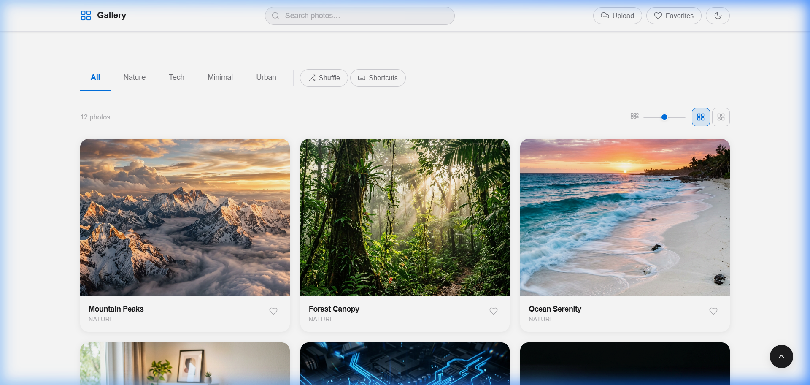
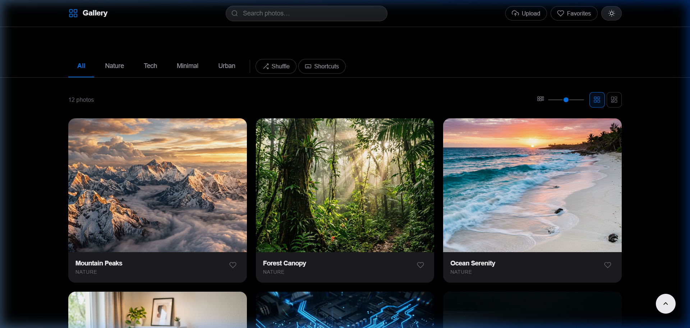
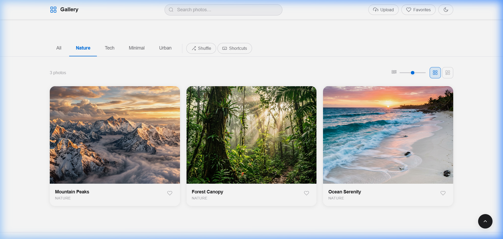
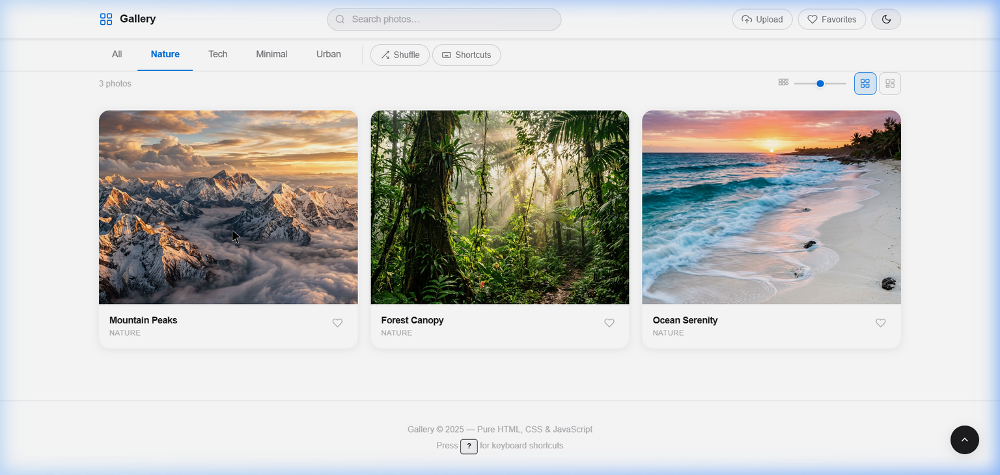
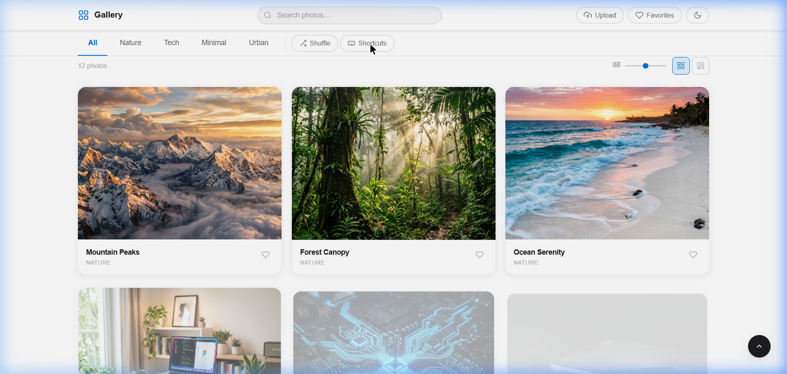

# 🖼️ Gallery — Premium Image Collection

> **CodeAlpha Internship Project** | Task: Image Gallery  
> Built with pure **HTML**, **CSS**, and **JavaScript** — no frameworks, no dependencies.

A premium, Apple-inspired image gallery web application featuring a lightbox viewer, category filtering, dark mode, drag-and-drop upload, keyboard navigation, and much more — all crafted from scratch.

---

## 📸 Screenshots

### Main Gallery — Light Mode


### Main Gallery — Dark Mode


### Category Filter — Nature


### Image Hover & Quick Actions


### Full Gallery View


---

## ✨ Features

| Feature | Description |
|---|---|
| 🔍 **Live Search** | Instantly filters images by title, category, or tags as you type |
| 🏷️ **Category Filters** | One-click filtering: All · Nature · Tech · Minimal · Urban |
| 🌗 **Dark / Light Mode** | Smooth theme toggle with preference persistence |
| 🖼️ **Lightbox Viewer** | Full-screen image viewer with zoom controls (50%–300%) |
| 📤 **Upload Images** | Click to upload or drag-and-drop images directly into the gallery |
| ❤️ **Favourites** | Mark photos as favourites; filter to view them instantly |
| 💾 **Download** | One-click download of any image from the lightbox |
| 📤 **Share** | Share images via the Web Share API |
| 📁 **Albums** | Create custom albums and organize photos into collections |
| 🔀 **Shuffle** | Randomly re-order the gallery with one click |
| 📐 **Grid Density Slider** | Adjust column width from compact to wide in real time |
| ⊞ / ⊟ **View Modes** | Switch between uniform Grid and Pinterest-style Masonry layout |
| ⌨️ **Keyboard Shortcuts** | Full keyboard navigation for power users |
| 🎨 **Colour Swatches** | Dominant colour palette extracted per image in the lightbox |
| 📋 **Context Menu** | Right-click any image for quick actions |
| ♿ **Accessible** | ARIA roles, keyboard navigation, and screen-reader support |
| 📱 **Responsive** | Fully responsive — works perfectly on mobile, tablet, and desktop |

---

## ⌨️ Keyboard Shortcuts

### Gallery
| Shortcut | Action |
|---|---|
| `/` | Focus search bar |
| `?` | Show keyboard shortcuts panel |
| `G` | Toggle dark / light mode |
| `Shift + S` | Shuffle photos |

### Lightbox
| Shortcut | Action |
|---|---|
| `←` / `→` | Navigate previous / next image |
| `Esc` | Close lightbox |
| `F` | Toggle favourite |
| `D` | Download image |
| `S` | Share image |
| `Z` | Zoom in |
| `X` | Zoom out |
| `R` | Reset zoom to 100% |
| `I` | Toggle image metadata panel |

---

## 🗂️ Project Structure

```
CodeAlpha_ImageGallery/
├── index.html          # App entry point — semantic HTML5 structure
├── styles.css          # Full design system — tokens, layout, animations
├── script.js           # All interactive logic — filtering, lightbox, upload
├── screenshots/        # README screenshots
│   ├── 01_gallery_light.png
│   ├── 02_gallery_dark.png
│   ├── 03_lightbox.png
│   ├── 04_filter_nature.png
│   └── 05_all_photos.png
└── images/             # Sample gallery images
    ├── nature_mountains.png
    ├── nature_forest.png
    ├── nature_ocean.png
    ├── tech_workspace.png
    ├── tech_circuit.png
    ├── tech_phone.png
    ├── minimal_coffee.png
    ├── minimal_flower.png
    ├── minimal_geometric.png
    ├── urban_night.png
    ├── urban_alley.png
    └── urban_aerial.png
```

---

## 🚀 Getting Started

No build step, no dependencies — just open and run.

### Option 1 — Open Directly
```bash
# Simply open in your browser
open index.html
```

### Option 2 — Local Dev Server (recommended for full features)
```bash
# Using VS Code Live Server extension, or:
npx serve .
# Then visit http://localhost:3000
```

> **Note:** Drag-and-drop upload, Web Share API, and some browser APIs require a server context (not `file://`). Use a local dev server for the full experience.

---

## 🛠️ Tech Stack

| Layer | Technology |
|---|---|
| Structure | Semantic **HTML5** |
| Styling | Vanilla **CSS3** (custom properties, Grid, Flexbox, animations) |
| Logic | Vanilla **JavaScript** (ES2020+, no libraries) |
| Icons | Inline **SVG** |
| Fonts | System font stack (SF Pro / Segoe UI) |

---

## 📋 Implementation Highlights

- **CSS Custom Properties** for a consistent design token system (colours, spacing, radii, shadows)
- **CSS Grid + auto-fill** for the responsive gallery layout with adjustable column widths via a range slider
- **IntersectionObserver** for lazy-loading images and infinite scroll pagination
- **DragEvent API** for native drag-and-drop file upload
- **FileReader API** to preview locally uploaded images before adding to the gallery
- **localStorage** for persisting favourites, albums, and theme preference across sessions
- **Web Share API** with clipboard fallback for the share feature
- **ARIA live regions** for accessible status announcements (search results count, toast notifications)
- **Smooth CSS transitions** on all interactive states — hover, focus, open/close

---

## 👤 Author

**Bhaumik** — CodeAlpha Internship (Web Development)  
GitHub: [@Bhaumik1904](https://github.com/Bhaumik1904)

---

## 📄 License

This project is open source and available under the [MIT License](LICENSE).
